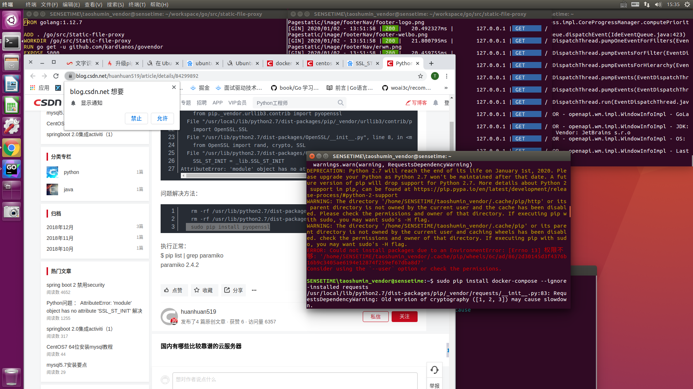
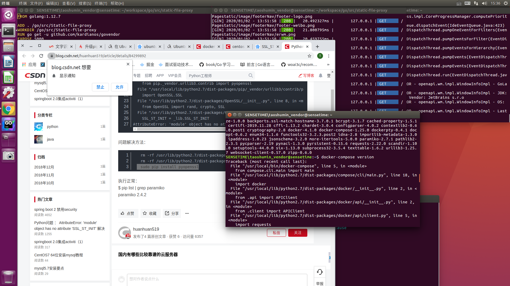

## 1.1docker-compose 安装过程中2.0~3.0存在的问题



#### 1.1 可能问题 

```shell
Installing collected packages: texttable, subprocess32, urllib3, certifi, chardet, idna, requests, websocket-client, pycparser, cffi, bcrypt, pynacl, cryptography, paramiko, docker, backports.shutil-get-terminal-size, docker-compose
  Found existing installation: texttable 0.8.1
ERROR: Cannot uninstall 'texttable'. It is a distutils installed project and thus we cannot accurately determine which files belong to it which would lead to only a partial uninstall.
SENSETIME\taoshumin_vend
```

解决方案:

```shell
$ sudo pip install docker-compose --ignore -installed request
```


#### 1.2 可能存在问题



```shell
, line 97, in <module>
    from pip._vendor.urllib3.contrib import pyopenssl
  File "/usr/local/lib/python2.7/dist-packages/pip/_vendor/urllib3/contrib/pyopenssl.py", line 46, in <module>
    import OpenSSL.SSL
  File "/usr/lib/python2.7/dist-packages/OpenSSL/__init__.py", line 8, in <module>
    from OpenSSL import rand, crypto, SSL
  File "/usr/lib/python2.7/dist-packages/OpenSSL/SSL.py", line 118, in <module>
    SSL_ST_INIT = _lib.SSL_ST_INIT
AttributeError: 'module' object has no attribute 'SSL_ST_INIT'
```

解决方案:

```shell
$ rm -rf /usr/lib/python2.7/dist-packages/OpenSSL
$ rm -rf /usr/lib/python2.7/dist-packages/pyOpenSSL-0.15.1.egg-info
$ sudo pip install pyopenssl
```

## 1.2 docker 制作镜像

```shell
# 制作镜像
$ docker build -t 镜像名:tag . 
# 运行镜像
$ docker run -itd --name 容器名 -p 宿主机port:容器port 镜像名
```

#### 1.2.1 直接删除所有镜像或容器

```shell
# 直接删除所有镜像
docker rmi `docker images -q`
# 直接删除所有容器
docker rm `docker ps -aq`

# 按条件筛选之后删除镜像
docker rmi `docker images | grep xxxxx | awk '{print $3}'`
# 按条件筛选之后删除容器
docker rm `docker ps -a | grep xxxxx | awk '{print $1}'`
```


## 1.4 Go [老外的写法]

#### 1.4.1 定时器

```go
func startInternalMetrics(ctx context.Context, wg *sync.WaitGroup, storage *Storage, interval uint) {
	var memstats runtime.MemStats
	var metricsTicker *time.Ticker

	if interval > 0 {
		metricsTicker = time.NewTicker(time.Duration(interval) * time.Second)
	} else {
		metricsTicker = time.NewTicker(15 * time.Second)
	}

	wg.Add(1)
	defer wg.Done()

	for {
		select {
		case <-metricsTicker.C:
			runtime.ReadMemStats(&memstats)
			storage.MetricDistributor <- makeInternalMetric("mem.alloc", float64(memstats.Alloc))
			storage.MetricDistributor <- makeInternalMetric("heap.alloc", float64(memstats.HeapAlloc))
			storage.MetricDistributor <- makeInternalMetric("heap.in_use", float64(memstats.HeapInuse))
			storage.MetricDistributor <- makeInternalMetric("num_goroutines", float64(runtime.NumGoroutine()))

		case <-ctx.Done():
			log.Println("Cancellation request received.  Cancelling job runner.")
			return
		}
	}
```

#### 1.4.2  [Context传递]


```go
func NewJobRunner(ctx context.Context) *JobRunner {
	jr := JobRunner{
		ctx: ctx,
	}
	jr.JobChan = make(chan Job, 10)
	return &jr
}
```

